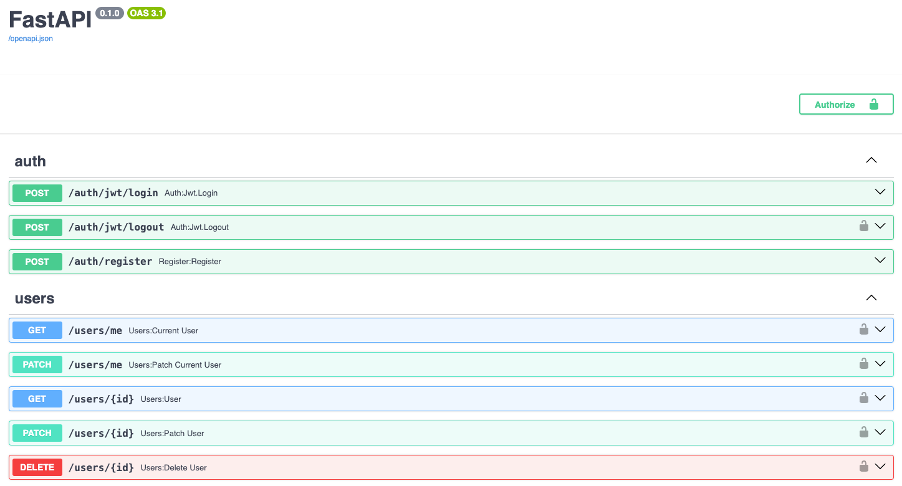
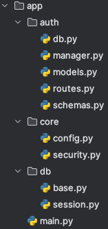

# FastAPI User Management 🛠️

A simple and efficient **FastAPI-based user management system** with **authentication** and **role-based access**.

## Features 🚀

* **User Authentication:** Register, login, and JWT-based authentication.
* **Superuser Creation:** Automatically creates a superuser on first run.
* **Role-based Access Control:** Manage users with roles, e.g., superuser.
* **SQLite Database:** Uses SQLite (async) for user data storage.
* **FastAPI:** High-performance web framework for APIs.

## Technologies 🧑‍💻

* **FastAPI:** Web framework for building APIs.
* **SQLAlchemy:** ORM for interacting with the database.
* **FastAPI-Users:** Pre-built user management for FastAPI.
* **SQLite:** Lightweight database for local development.

## Setup & Installation ⚙️

### 1. Clone the Repository
`git clone https://github.com/your-username/fastapi-user-management.git
cd fastapi-user-management`

### 2. Create & Activate Virtual Environment
`python3 -m venv .venv
source .venv/bin/activate  # On Windows, use '.venv\Scripts\activate'`

### 3. Install Dependencies
`pip install -r requirements.txt`

### 4. Run the App 🏃‍♂️

Start the FastAPI server:

`uvicorn app.main:app --reload`

Access the app at http://127.0.0.1:8000.

### 5. Swagger UI 📄

You can view the interactive documentation at:

http://127.0.0.1:8000/docs

or

## Project Structure 📁

## Contributing 🤝

1. Fork the repository.
2. Create a new branch for your feature.
3. Commit your changes.
4. Push to your fork.
5. Open a pull request to the main repository.

## License 📜

This project is licensed under the MIT License.